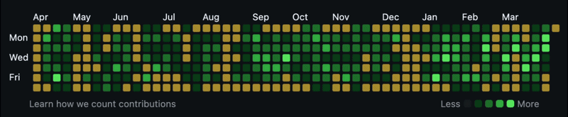
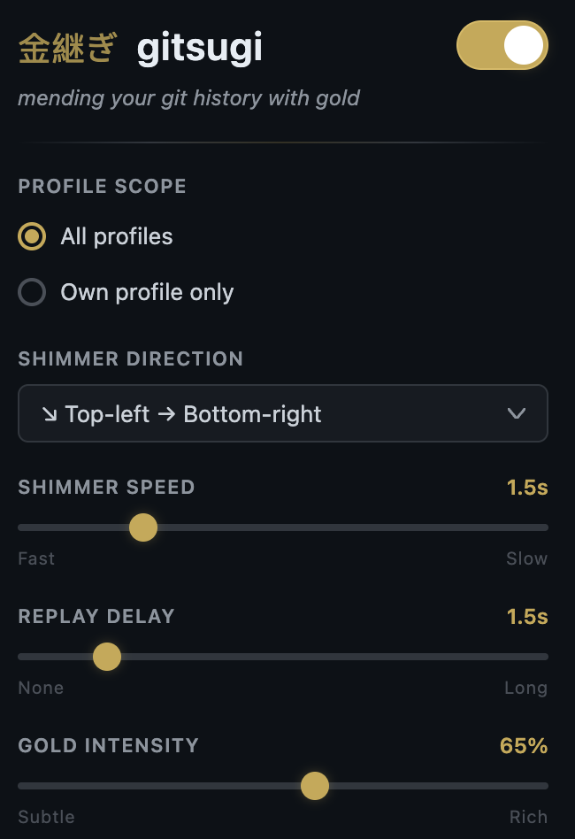

# 金継ぎ gitsugi

**Mend the gaps in your GitHub contribution graph with gold.**

[Kintsugi](https://en.wikipedia.org/wiki/Kintsugi) (金継ぎ) is the Japanese art of repairing broken pottery by joining the cracks with gold, treating the breakage as part of the object's history rather than something to hide.

Gitsugi applies the same idea to your GitHub profile. Empty days on your contribution graph aren't failures. They're rest, life, weekends, all the things that happen between the code. This extension fills those gaps with gold and a gentle shimmer, turning absence into something worth looking at.



## Features

- Paints empty contribution cells with gold
- Animated shimmer that sweeps across the graph in a configurable direction
- Adjustable speed, delay, and gold intensity
- Scope to your own profile or apply to all profiles you visit
- Tooltip text changes from "No contributions" to "Mended with gitsugi"
- Toggle on/off from the popup

## Install

This is an unpacked Chrome extension (Manifest V3). No build step required.

1. Clone the repo

   ```
   git clone https://github.com/johnrbell/gitsugi.git
   ```

2. Open Chrome and go to `chrome://extensions`

3. Enable **Developer mode** (toggle in the top-right corner)

4. Click **Load unpacked** and select the `gitsugi` folder

5. Visit any GitHub profile and the contribution graph should glow gold

## Settings

Click the extension icon to open the popup.



From there you can adjust:

| Setting | What it does |
|---|---|
| **Toggle** | Enable / disable the effect |
| **Profile Scope** | Apply to all profiles or only your own |
| **Shimmer Direction** | Which way the shimmer wave travels (8 directions) |
| **Shimmer Speed** | How fast the wave sweeps across the graph |
| **Replay Delay** | Pause between shimmer cycles |
| **Gold Intensity** | How rich or subtle the gold color is |
